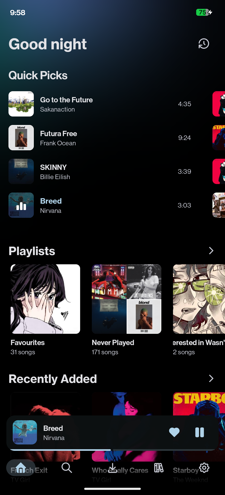
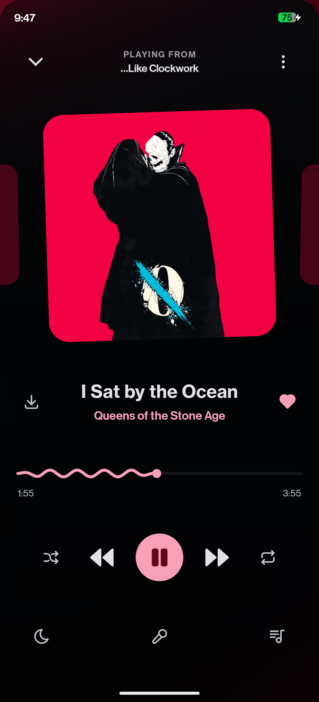
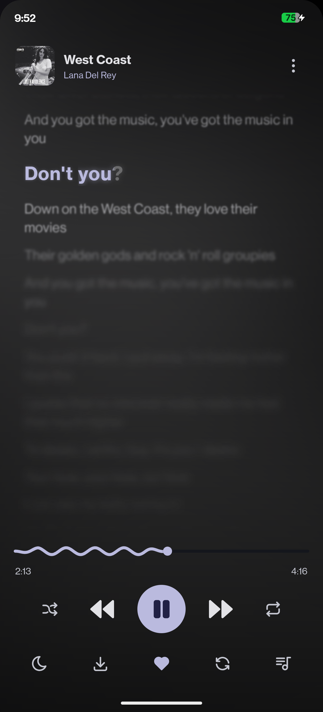
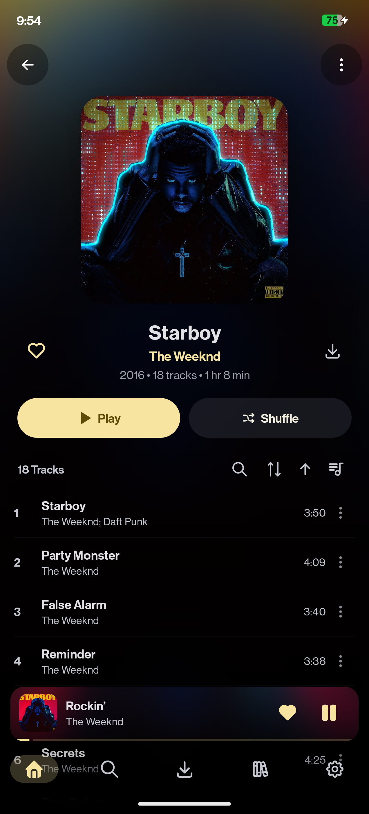

# Uta

<i> A beautiful, open-source music client for Subsonic-compatible servers </i>

---

## Screenshots

| **Home** | **Player** | **Lyrics** | **Album** |
|:---:|:---:|:---:|:---:|
|  |  |  |  |
