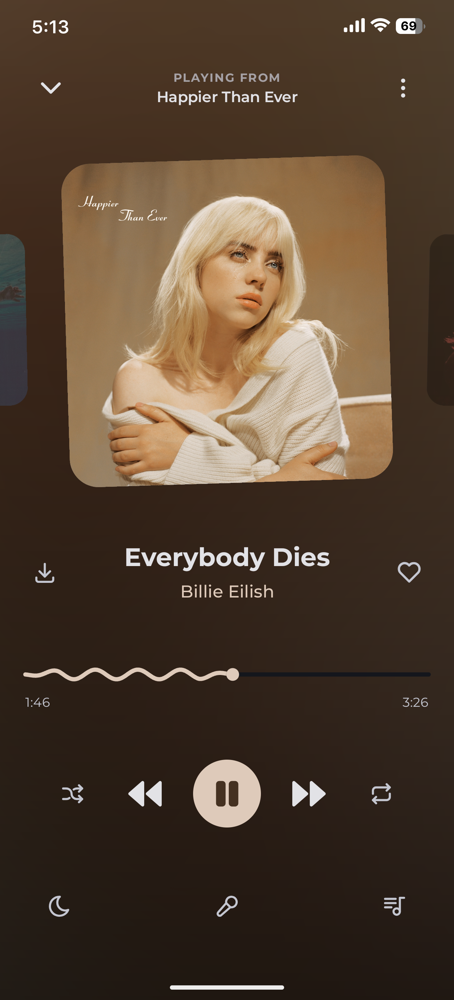
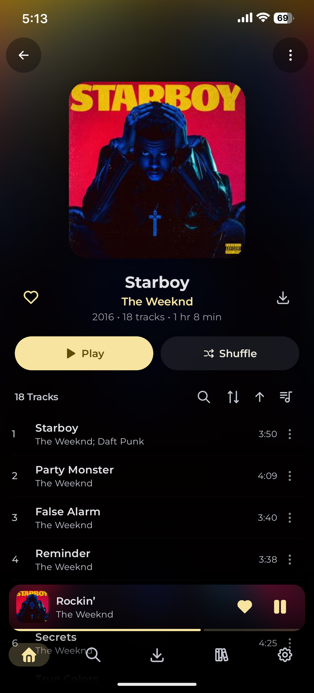
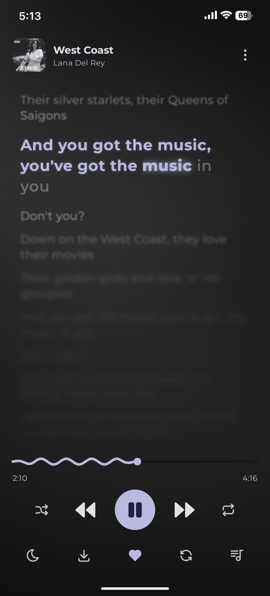
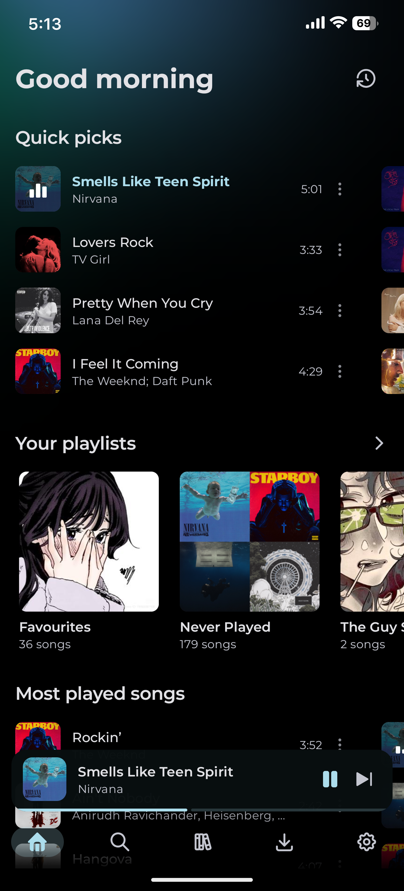
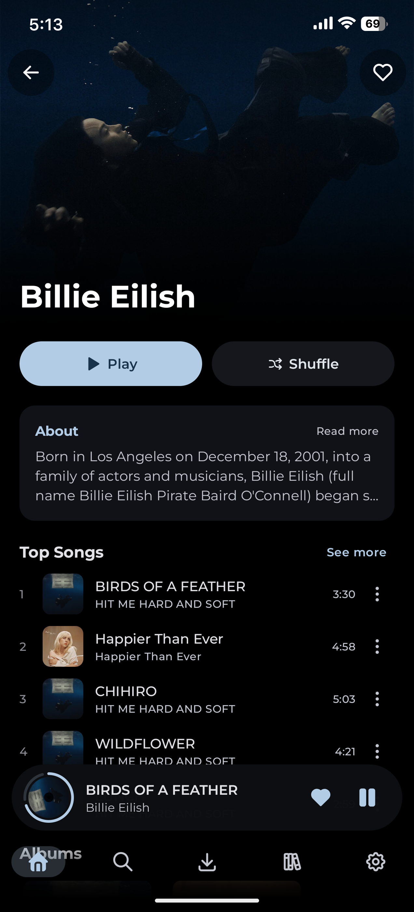
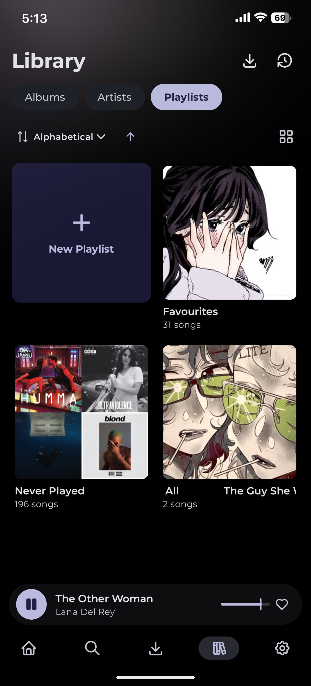
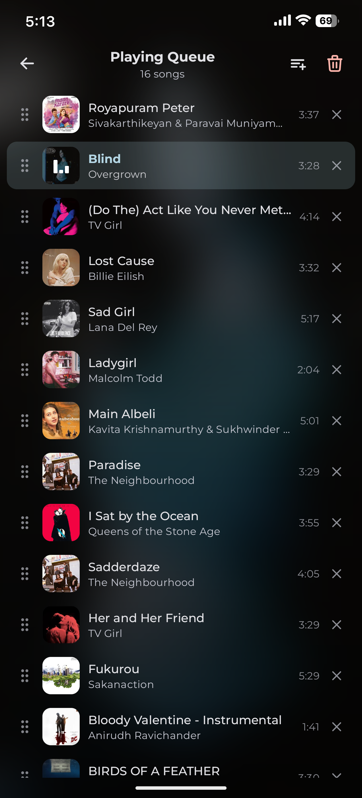
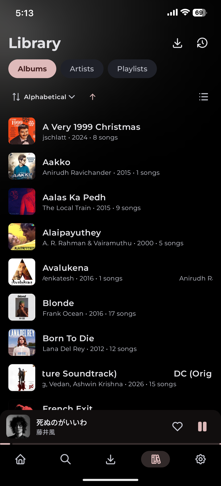

# Uta

<i> A beautiful, open-source music client for Subsonic-compatible servers </i>

---

## Screenshots

| **Player** | **Album** | **Lyrics** | **Home** |
|:---:|:---:|:---:|:---:|
|  |  |  |  |
| **Artist** | **Playlist** | **Queue** | **Library** |
|  |  |  |  |

---

## Installation

Get the latest APK from the [Releases](https://github.com/NotMugil/uta/releases/latest) page.  

Also you can get automatic updates directly via [Obtainium](https://apps.obtainium.imranr.dev/redirect?r=obtainium://add/https://github.com/NotMugil/uta).

---

## License
This project is licensed under the [GNU General Public License v3.0 (GPL-3.0)](./LICENSE)